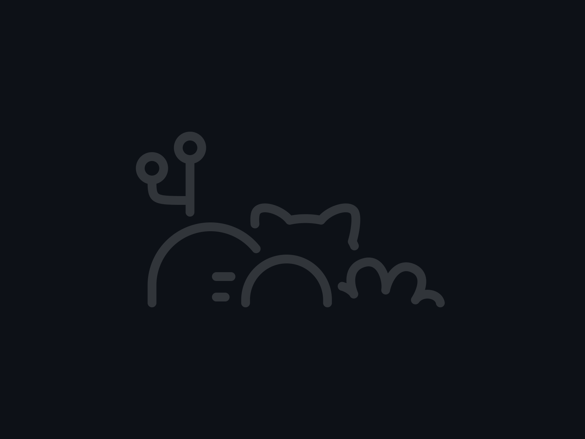

<h2 align="center">Hi, I'm Molly Kao 👋</h2>

  <em>Medical Imaging · Computer Vision · Radar Sensing · Machine Learning</em>

---

I build systems where **signals become images, images become data, and data becomes decisions**.  
My work sits at the intersection of **imaging systems, signal processing, and AI-driven modeling**, with a focus on real-world healthcare and sensing applications.

🔍 Actively seeking **research opportunities** in:
- Medical Imaging & Medical Devices
- Computer Vision & Machine Learning
- Radar / Intelligent Sensing Systems

---

### 🛠️ Tech Stack

  
  
  
  
  
  
  
  
  

---

### 🌱 What I Value
Clean systems · Interpretable models ·  
Cross-disciplinary collaboration between **hardware, signals, and learning**

---

### 📫 Connect with Me

<!--
**Dino-Boooo/Dino-Boooo** is a ✨ _special_ ✨ repository because its `README.md` (this file) appears on your GitHub profile.

Here are some ideas to get you started:

- 🔭 I’m currently working on ...
- 🌱 I’m currently learning ...
- 👯 I’m looking to collaborate on ...
- 🤔 I’m looking for help with ...
- 💬 Ask me about ...
- 📫 How to reach me: ...
- 😄 Pronouns: ...
- ⚡ Fun fact: ...
-->
